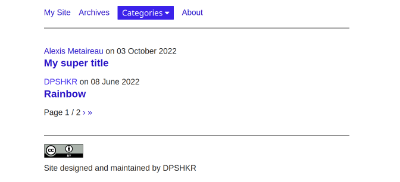
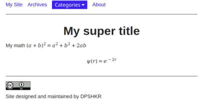

# sakura-pelican
Minimal and simple but functional Pelican SSG theme based on Sakura CSS framework.
* Support for standard features like categories and pagination.
* Responsive
* Basic support for writing mathematics (see below).

# Writing mathematics

Pelican does not provide native support for writing mathematics.
However, the reStructuredText format parser built into Python used by Pelican has native support to [write mathematics](https://docutils.sourceforge.io/docs/ref/rst/mathematics.html).
Mathematical content is displayed using just CSS rules provided by `math2html.css`. 
It works well for many purposes but may not be sufficient for advanced use cases. 
Use [Pelican render math](https://github.com/pelican-plugins/render-math) plugin for more advanced use cases.
This plugin utilizes mathjax. 
Note that math in markdown format is not supported. 
Please see the documentation of reStructuredText for more details.

# Theme flavours

Various flavours of the theme can be set by the variable `THEME_FLAVOUR` in `pelicanconf.py`. 
Available flavours are `ink`, `pink`, `earthly`, `dark`, `dark-solarized`, `vader` and `sakura`.
Default flavour is `sakura`.

# Creative Commons License

Content can be licensed with various creative common licenses if you choose to do so.
An appropriate CC license logo will be added to the footer. 
This can be done by seeting `LICENSE` variable in ``pelicanconf.py`.
Available options are `CC0`, `CC-BY`, `CC-BY-SA`, `CC-BY-NC`, `CC-BY-NC-SA`, `CC-BY-ND`, `CC-BY-NC-ND`.

# Footer note

You can display some footer note in the footer by setting the `FOOTER_NOTE` variable in `pelicanconf.py`.

